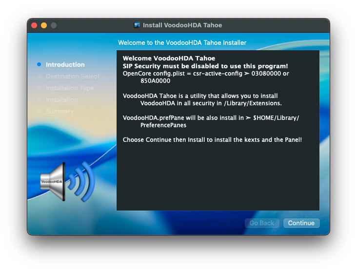

# VoodooHDA-Tahoe
VoodooHDA Tahoe is a utility that allows you to install VoodooHDA

### Package to using in macOS Tahoe 26
- Make sure to remove VoodooHDA.kext and VoodooHDA.prefPane if it is already installed on your system, after deleting VoodooHDA you will need to reboot your macOS before using this program.


- Credit: [VoodooHDA Project](https://github.com/CloverHackyColor/VoodooHDA)

- [x] `Clone and Build VoodooHDA-Tahoe:`
```bash
git clone --branch prodesk-600-g1 https://github.com/chris1111/VoodooHDA-Tahoe.git && cd $HOME/VoodooHDA-Tahoe && ./Package.command && open -R $HOME/VoodooHDA-Tahoe/VoodooHDA-Tahoe.pkg
```

* You can rebuild the VoodooHDA-Tahoe.pkg any time by double click to Package.command
